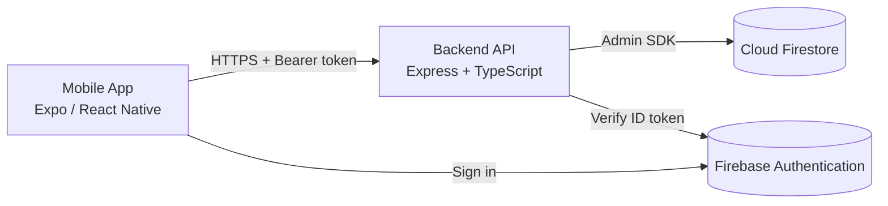

<p align="center">
  
</p>

# EasySplit

## Introduction

EasySplit là ứng dụng mobile quản lý chi tiêu nhóm, giúp bạn bè, gia đình hoặc nhóm du lịch ghi nhận chi phí chung, theo dõi ai nợ ai và thanh toán minh bạch. Mọi thay đổi tài chính đều có thể truy vết qua audit log.

Dự án gồm hai phần chính:

- **Frontend** — ứng dụng React Native (Expo) chạy trên iOS, Android và web
- **Backend** — REST API Node.js (Express + TypeScript) kết nối Cloud Firestore và Firebase Authentication

## Features

### Nhóm & thành viên

- Tạo nhóm, mời thành viên, phân quyền `owner` / `admin` / `member`
- Đóng nhóm khi không còn hoạt động

### Chi phí & số dư

- Tạo expense với nhiều chế độ chia: `equal`, `amount`, `percent`, `weight`
- Tính balances tự động sau mỗi thay đổi
- Xem số dư cá nhân và danh sách nợ trong nhóm

### Thanh toán & settlement

- Đề xuất bù trừ thông minh (smart settle)
- Ghi nhận settlement và commit giao dịch an toàn với **idempotency** (tránh trùng lặp)

### Xã hội & tiện ích

- Kết bạn, gửi/chấp nhận lời mời kết bạn
- Tìm kiếm người dùng
- Nhắc nhở thanh toán
- Lịch sử hoạt động (activity) trong nhóm

### Tài khoản & gói miễn phí

- Đăng nhập/đăng ký qua Firebase Authentication
- Đồng bộ profile (`/auth/sync`)
- Theo dõi subscription và usage theo free tier

## Tech Stack

| Layer        | Công nghệ                                                                  |
| ------------ | -------------------------------------------------------------------------- |
| Mobile       | React Native 0.81, Expo 54, Expo Router, TypeScript                        |
| State / HTTP | Zustand, Axios                                                             |
| Backend      | Node.js, Express 4, TypeScript                                             |
| Database     | Cloud Firestore (Firebase Admin SDK)                                       |
| Auth         | Firebase Authentication (production/staging); JWT + dev-auth (development) |
| Validation   | Zod                                                                        |
| Logging      | Pino                                                                       |
| Tests        | Jest, ts-jest (backend); Jest, React Testing Library (frontend)            |
| API docs     | OpenAPI 3, Postman collection                                              |
| CI           | GitHub Actions                                                             |

## System Architecture



Luồng xác thực chính:

1. Client đăng nhập Firebase Auth và lấy Firebase ID token.
2. Mọi request bảo vệ gửi header `Authorization: Bearer <firebase_id_token>`.
3. Backend xác minh token, đồng bộ user vào Firestore và xử lý business logic.
4. Firestore là nguồn dữ liệu cho users, groups, expenses, balances, settlements, reminders, audit logs và idempotency keys.

## Project Structure

```
EasySplit-app/
├── backend/                 # REST API
│   ├── src/
│   │   ├── app.ts           # Express app, middleware, route mounting
│   │   ├── config/          # Env config
│   │   ├── lib/             # Firebase, JWT, errors, response helpers
│   │   ├── middleware/      # Auth, idempotency, validation, logging
│   │   ├── modules/         # Domain modules (auth, group, expense, …)
│   │   └── routes/          # Health, API router
│   ├── tests/unit/          # Jest unit tests
│   └── .env.example
├── frontend/                # Expo mobile app
│   ├── app/                 # Expo Router screens (auth, tabs, group flows)
│   ├── api/                 # Client, services, types, endpoints
│   ├── components/
│   ├── hooks/
│   └── assets/images/
├── docs/
│   ├── openapi.yaml         # OpenAPI specification
│   └── staging-deployment-runbook.md
├── postman/
│   └── easysplit.postman_collection.json
└── .github/workflows/       # CI pipelines
```

### Backend modules

| Module           | Mô tả                                         |
| ---------------- | --------------------------------------------- |
| `auth`           | Đồng bộ Firebase user, dev-auth (development) |
| `user` / `users` | Profile hiện tại, tìm kiếm user               |
| `friend`         | Bạn bè, lời mời                               |
| `group`          | Nhóm, thành viên, vai trò                     |
| `expense`        | Chi phí, chia bill                            |
| `balance`        | Số dư, nợ                                     |
| `settlement`     | Settlement, smart settle                      |
| `reminder`       | Nhắc nhở                                      |
| `activity`       | Audit / lịch sử                               |

## Installation

### Yêu cầu

- Node.js 20+
- npm
- Tài khoản Firebase (Auth + Firestore) cho backend
- [Expo Go](https://expo.dev/go) hoặc emulator/simulator (cho frontend)

### Backend

```bash
cd backend
cp .env.example .env   # chỉnh sửa theo môi trường của bạn
npm install
npm run dev            # chạy với tsx watch (mặc định http://localhost:8080)
```

Build và chạy production:

```bash
npm run build
npm start
```

### Frontend

```bash
cd frontend
cp .env.example .env   # đặt EXPO_PUBLIC_API_URL trỏ tới backend
npm install
npx expo start
```

Chạy trên thiết bị cụ thể:

```bash
npm run android   # Android
npm run ios       # iOS
npm run web       # Web
```

> Khi test trên điện thoại thật, dùng IP LAN của máy dev thay cho `localhost` trong `EXPO_PUBLIC_API_URL`.

## Environment Variables

### Backend (`backend/.env`)

Tham khảo đầy đủ tại `backend/.env.example`.

| Biến                                                                   | Mô tả                                                   |
| ---------------------------------------------------------------------- | ------------------------------------------------------- |
| `PORT`                                                                 | Cổng server (mặc định `8080`)                           |
| `NODE_ENV`                                                             | `development` \| `staging` \| `production`              |
| `DEV_AUTH_ENABLED`                                                     | `true` chỉ khi dev; **phải `false` trên production**    |
| `CORS_ORIGIN`                                                          | Origin được phép (staging/production)                   |
| `JWT_SECRET`, `JWT_EXPIRES_IN`, `JWT_REFRESH_EXPIRES_IN`               | JWT cho dev/test (production dùng Firebase token)       |
| `FIREBASE_PROJECT_ID`, `FIREBASE_CLIENT_EMAIL`, `FIREBASE_PRIVATE_KEY` | Credential Firebase Admin (một trong các cách bên dưới) |
| `FIREBASE_SERVICE_ACCOUNT_JSON`                                        | Hoặc JSON service account inline                        |
| `FIREBASE_SERVICE_ACCOUNT_BASE64`                                      | Hoặc JSON đã encode base64                              |
| `GOOGLE_APPLICATION_CREDENTIALS`                                       | Hoặc đường dẫn file service account                     |
| `FIREBASE_FIRESTORE_DATABASE_ID`                                       | ID database Firestore (mặc định `(default)`)            |
| `FREE_MAX_GROUPS`, `FREE_SMART_SETTLE_PER_MONTH`, `FREE_HISTORY_DAYS`  | Giới hạn free tier                                      |
| `IDEMPOTENCY_WINDOW_HOURS`, `IDEMPOTENCY_PROCESSING_TIMEOUT_SECONDS`   | Cửa sổ idempotency                                      |

**Lưu ý:** Chỉ cần **một** cách cung cấp Firebase Admin credentials. Không commit file `.env` hoặc service account JSON.

### Frontend (`frontend/.env`)

| Biến                  | Mô tả                                                 |
| --------------------- | ----------------------------------------------------- |
| `EXPO_PUBLIC_API_URL` | Base URL API, ví dụ `http://192.168.1.10:8080/api/v1` |

## API Documentation

- **OpenAPI:** [`docs/openapi.yaml`](docs/openapi.yaml)
- **Postman:** [`postman/easysplit.postman_collection.json`](postman/easysplit.postman_collection.json)
- **Staging runbook:** [`docs/staging-deployment-runbook.md`](docs/staging-deployment-runbook.md)

### Base URL

| Môi trường | URL                            |
| ---------- | ------------------------------ |
| Local      | `http://localhost:8080/api/v1` |
| Staging    | URL deploy thực tế + `/api/v1` |

### Nhóm endpoint chính

| Tag         | Path (prefix `/api/v1`)                                  |
| ----------- | -------------------------------------------------------- |
| Health      | `GET /health`, `GET /ready`                              |
| Auth        | `POST /auth/sync`                                        |
| Me          | `GET/PATCH /me`, `GET /me/subscription`, `GET /me/usage` |
| Users       | `GET /users` (search)                                    |
| Friends     | `/friends`, `/friends/requests`                          |
| Groups      | `/groups`, `/groups/:groupId`, members, close            |
| Expenses    | `/groups/:groupId/expenses`                              |
| Balances    | `/groups/:groupId/balances`                              |
| Settlements | `/groups/:groupId/settlements`, smart-settle             |
| Reminders   | `/groups/:groupId/reminders`                             |
| Activity    | `/groups/:groupId/activity`                              |

### Postman

1. Import collection từ `postman/`.
2. Đặt biến `baseUrl` (ví dụ `http://localhost:8080/api/v1`).
3. Đặt `firebaseIdToken` sau khi đăng nhập Firebase.

Protected endpoints yêu cầu:

```
Authorization: Bearer <firebase_id_token>
```

## Deployment

Chi tiết triển khai staging/production: [`docs/staging-deployment-runbook.md`](docs/staging-deployment-runbook.md).

### Backend

1. Tạo Firebase project (staging/production riêng).
2. Bật Authentication và Cloud Firestore.
3. Tạo service account, lưu credentials trong secret manager của platform.
4. Deploy Node.js service:

```bash
cd backend
npm install
npm run build
npm start
```

Nền tảng gợi ý: **Render**, **Railway**, **Fly.io**, **Google Cloud Run**, **AWS**, **Azure**, hoặc VPS (PM2/systemd).

### Smoke test sau deploy

```bash
curl https://<your-api-host>/api/v1/health
curl https://<your-api-host>/api/v1/ready
```

### Frontend

- Build bản release qua [EAS Build](https://docs.expo.dev/build/introduction/) hoặc `expo export` cho web.
- Cấu hình `EXPO_PUBLIC_API_URL` trỏ tới API đã deploy.

## Testing

### Backend

```bash
cd backend
npm test                              # unit tests
npx jest --coverage --colors=never    # kèm coverage
```

Báo cáo coverage chi tiết: [`docs/test-coverage-report.md`](docs/test-coverage-report.md) · [backend](backend/coverage-report.md) · [frontend](frontend/coverage-report.md).

Các suite chính: `auth`, `user`, `users`, `friend`, `group`, `expense`, `balance`, `settlement`, `reminder`, `activity`.

### Frontend

```bash
cd frontend
npm run testFinal        # chạy test (không coverage)
npm run test:coverage    # test + coverage, ngưỡng tối thiểu 70%
npm test                 # watch mode (changedSince origin/main)
```

**Loại test** (thư mục `frontend/__tests__/`):

| Loại | Ví dụ |
|------|--------|
| Unit | API services, `token.storage`, `endpoints`, `client` interceptors |
| Component | `ThemedText`, `LoadingScreen` |
| Store | `auth.store` (Zustand) |
| Hooks | `useAuth`, `useAppTheme`, `use-theme-color` |
| Integration | Luồng login → `fetchMe` |

Coverage tập trung vào logic nghiệp vụ (`api/`, `store/`, `hooks/`, `constants/`). Ngưỡng CI: **≥ 70%** statements/branches/functions/lines. Báo cáo: [`docs/test-coverage-report.md`](docs/test-coverage-report.md).

## CI/CD

| Workflow                                                 | Trigger                        | Hành động                                                                     |
| -------------------------------------------------------- | ------------------------------ | ----------------------------------------------------------------------------- |
| [frontend-test.yml](.github/workflows/frontend-test.yml) | Push/PR thay đổi `frontend/**` | Checkout → Node 20 → `npm ci` → `npm run test:ci` (coverage ≥ 70%)            |
| [backend-test.yml](.github/workflows/backend-test.yml)   | Push/PR thay đổi `backend/**`  | Checkout → Node 20 → `npm ci` → `npm run lint` → `npm test` → `npm run build` |

## Screenshots

Ảnh logo, icon và splash nằm tại `frontend/assets/images/`:

| File                 | Mục đích                     |
| -------------------- | ---------------------------- |
| `logo-removebg.png`  | Logo app, màn hình đăng nhập |
| `splash-icon.png`    | Splash screen                |
| `android-icon-*.png` | Adaptive icon Android        |

> Bổ sung screenshot màn hình UI vào thư mục `docs/screenshots/` và chèn vào đây khi có bản demo.

## Contributors

- **Nhóm dự án:** L02-Mobile-App-Developers — EasySplit
- Muốn đóng góp: fork repo, tạo branch, mở Pull Request và mô tả thay đổi.

## License

Chưa có file `LICENSE` tại thư mục gốc. Vui lòng thêm license (ví dụ MIT) trước khi phát hành công khai.
