# EasySplit — Use Case Documentation

> **App:** EasySplit — Group Expense Management  
> **Platform:** React Native (Expo) · iOS · Android · Web  
> **Backend:** Node.js / Express / Cloud Firestore / Firebase Auth

---

## Table of Contents

1. [Actors](#1-actors)
2. [System Overview](#2-system-overview)
3. [Use Case Diagram](#3-use-case-diagram)
4. [UC-AUTH — Authentication & Profile](#4-uc-auth--authentication--profile)
5. [UC-GROUP — Group Management](#5-uc-group--group-management)
6. [UC-MEMBER — Member Management](#6-uc-member--member-management)
7. [UC-EXPENSE — Expense Management](#7-uc-expense--expense-management)
8. [UC-BALANCE — Balance & Debt](#8-uc-balance--debt)
9. [UC-SETTLE — Settlements](#9-uc-settle--settlements)
10. [UC-SMART — Smart Settle](#10-uc-smart--smart-settle)
11. [UC-REMIND — Reminders](#11-uc-remind--reminders)
12. [UC-ACTIVITY — Activity & History](#12-uc-activity--history)
13. [UC-FRIEND — Friends](#13-uc-friend--friends)
14. [UC-SUB — Subscription & Usage](#14-uc-sub--subscription--usage)
15. [Error & Edge Cases](#15-error--edge-cases)

---

## 1. Actors

| Actor | Description |
|-------|-------------|
| **Guest** | Unauthenticated user; can only access login/register/onboarding |
| **Member** | Authenticated user who belongs to one or more groups |
| **Admin** | Group member with elevated permissions (add/remove members, edit group) |
| **Owner** | Group creator; full control including closing the group |
| **System** | Backend services — handles balance recalculation, idempotency, audit logs |

---

## 2. System Overview

EasySplit enables friend groups, families, or travel companions to:

- Record shared expenses with flexible split modes
- Track who owes whom in real time
- Settle debts manually or via AI-assisted smart settlement
- Send payment reminders
- Audit all financial activities

```
┌─────────────┐     HTTPS + Bearer     ┌──────────────────┐
│  Mobile App │ ─────────────────────► │  Backend API      │
│ (Expo/RN)   │ ◄───────────────────── │  Express + TS     │
└─────────────┘                        └────────┬─────────┘
       │                                        │
       │ Firebase Auth SDK                      │ Firebase Admin SDK
       ▼                                        ▼
┌──────────────────┐               ┌─────────────────────┐
│ Firebase Auth    │               │   Cloud Firestore    │
│ (Sign in/out)    │               │ (All data & state)   │
└──────────────────┘               └─────────────────────┘
```

---

## 3. Use Case Diagram

```mermaid
graph TD
  Guest -->|"UC-AUTH-01: Register"| Auth
  Guest -->|"UC-AUTH-02: Login"| Auth
  Member -->|"UC-AUTH-03: Update Profile"| Auth
  Member -->|"UC-AUTH-04: Logout"| Auth

  Member -->|"UC-GROUP-01: Create Group"| Group
  Member -->|"UC-GROUP-02: View Groups"| Group
  Member -->|"UC-GROUP-03: View Group Detail"| Group
  Admin  -->|"UC-GROUP-04: Edit Group"| Group
  Owner  -->|"UC-GROUP-05: Close Group"| Group

  Admin  -->|"UC-MEMBER-01: Add Member"| Members
  Admin  -->|"UC-MEMBER-02: Remove Member"| Members
  Owner  -->|"UC-MEMBER-03: Change Role"| Members

  Member -->|"UC-EXPENSE-01: Create Expense"| Expense
  Member -->|"UC-EXPENSE-02: View Expenses"| Expense
  Member -->|"UC-EXPENSE-03: Edit Expense"| Expense
  Member -->|"UC-EXPENSE-04: Delete Expense"| Expense

  Member -->|"UC-BALANCE-01: View Balances"| Balance
  Member -->|"UC-BALANCE-02: View My Balance"| Balance
  Member -->|"UC-BALANCE-03: View Debt Edges"| Balance

  Member -->|"UC-SETTLE-01: Create Settlement"| Settlement
  Member -->|"UC-SETTLE-02: View Settlements"| Settlement

  Member -->|"UC-SMART-01: Get Smart Suggestions"| SmartSettle
  Owner  -->|"UC-SMART-02: One-click Group Settle"| SmartSettle

  Admin  -->|"UC-REMIND-01: Send Reminder"| Reminders
  Admin  -->|"UC-REMIND-02: Cancel Reminder"| Reminders

  Member -->|"UC-ACTIVITY-01: View Activity"| Activity
  Member -->|"UC-ACTIVITY-02: Filter History"| Activity

  Member -->|"UC-FRIEND-01: Search Users"| Friends
  Member -->|"UC-FRIEND-02: Send Friend Request"| Friends
  Member -->|"UC-FRIEND-03: Accept/Reject Request"| Friends
  Member -->|"UC-FRIEND-04: Unfriend"| Friends

  Member -->|"UC-SUB-01: View Subscription"| Subscription
  Member -->|"UC-SUB-02: View Usage"| Subscription
```



---

## 4. UC-AUTH — Authentication & Profile

### UC-AUTH-01: Register

| Field | Value |
|-------|-------|
| **Actor** | Guest |
| **Trigger** | User taps "Create account" on register screen |
| **Pre-condition** | User does not have an account |
| **Main Flow** | 1. User enters email, password, display name → 2. Firebase Auth creates account → 3. `POST /auth/sync` syncs user into Firestore → 4. App navigates to Home |
| **Alt Flow** | Email already in use → Show "Email already registered" error |
| **Post-condition** | User is authenticated; Firestore user record is created |
| **API** | `POST /auth/sync` |

### UC-AUTH-02: Login

| Field | Value |
|-------|-------|
| **Actor** | Guest |
| **Trigger** | User taps "Sign in" on login screen |
| **Pre-condition** | User has a registered account |
| **Main Flow** | 1. User enters email + password → 2. Firebase Auth returns ID token → 3. App stores token → 4. `POST /auth/sync` called → 5. Navigate to Home tab |
| **Alt Flow** | Wrong credentials → Show "Invalid email or password" |
| **Post-condition** | User session active; token stored locally |
| **API** | `POST /auth/sync` |

### UC-AUTH-03: Update Profile

| Field | Value |
|-------|-------|
| **Actor** | Member |
| **Trigger** | User edits display name or avatar on Profile screen |
| **Main Flow** | 1. User edits fields → 2. `PATCH /me` with `{ displayName, avatarUrl }` → 3. Profile updated |
| **API** | `PATCH /me` |

### UC-AUTH-04: Logout

| Field | Value |
|-------|-------|
| **Actor** | Member |
| **Trigger** | User taps "Logout" on Profile screen |
| **Main Flow** | 1. Firebase Auth sign-out → 2. Clear local token → 3. Redirect to Login |

### UC-AUTH-05: Forgot Password

| Field | Value |
|-------|-------|
| **Actor** | Guest |
| **Trigger** | User taps "Forgot password" on Login screen |
| **Main Flow** | 1. User enters email → 2. Firebase sends password reset email → 3. Show confirmation message |

---

## 5. UC-GROUP — Group Management

### UC-GROUP-01: Create Group

| Field | Value |
|-------|-------|
| **Actor** | Member |
| **Trigger** | User taps "+" on Group list screen |
| **Main Flow** | 1. User enters group name (max 80 chars) and category (`trip`/`food`/`roommate`/`project`/`other`) → 2. `POST /groups` → 3. New group appears in list; user becomes `owner` |
| **Validation** | Name required; max 80 chars; category required |
| **API** | `POST /groups` |

### UC-GROUP-02: View Groups List

| Field | Value |
|-------|-------|
| **Actor** | Member |
| **Trigger** | User opens app or navigates to Group tab |
| **Main Flow** | `GET /groups` → display list sorted by latest activity |
| **API** | `GET /groups` |

### UC-GROUP-03: View Group Detail

| Field | Value |
|-------|-------|
| **Actor** | Member |
| **Trigger** | User taps a group card |
| **Main Flow** | Load `GET /groups/:groupId`, expenses, balances, members, activity |
| **API** | `GET /groups/:groupId`, `GET /groups/:groupId/expenses`, `GET /groups/:groupId/balances` |

### UC-GROUP-04: Edit Group

| Field | Value |
|-------|-------|
| **Actor** | Admin / Owner |
| **Main Flow** | 1. User edits name or category → 2. `PATCH /groups/:groupId` |
| **API** | `PATCH /groups/:groupId` |

### UC-GROUP-05: Close Group

| Field | Value |
|-------|-------|
| **Actor** | Owner |
| **Trigger** | Owner selects "Close group" from settings |
| **Pre-condition** | Group is `active` |
| **Main Flow** | 1. Confirm dialog → 2. `POST /groups/:groupId/close` → 3. Group status becomes `closed` |
| **Post-condition** | No new expenses or settlements can be created |
| **API** | `POST /groups/:groupId/close` |

---

## 6. UC-MEMBER — Member Management

### UC-MEMBER-01: Add Member

| Field | Value |
|-------|-------|
| **Actor** | Admin / Owner |
| **Trigger** | Tap "Add member" in group settings |
| **Main Flow** | 1. Search existing users → 2. Select user → 3. `POST /groups/:groupId/members` with `{ userId, role }` |
| **API** | `POST /groups/:groupId/members` |

### UC-MEMBER-02: Remove Member

| Field | Value |
|-------|-------|
| **Actor** | Admin / Owner |
| **Main Flow** | 1. Select member → 2. Confirm removal → 3. `DELETE /groups/:groupId/members/:userId` |
| **Constraint** | Cannot remove the Owner |
| **API** | `DELETE /groups/:groupId/members/:userId` |

### UC-MEMBER-03: Change Member Role

| Field | Value |
|-------|-------|
| **Actor** | Owner |
| **Main Flow** | 1. Select member → 2. Choose new role (`admin`/`member`) → 3. `PATCH /groups/:groupId/members/:userId` |
| **API** | `PATCH /groups/:groupId/members/:userId` |

### UC-MEMBER-04: View Members

| Field | Value |
|-------|-------|
| **Actor** | Member |
| **Main Flow** | `GET /groups/:groupId/members` → list with avatar, role, joined date |
| **API** | `GET /groups/:groupId/members` |

---

## 7. UC-EXPENSE — Expense Management

### UC-EXPENSE-01: Create Expense

| Field | Value |
|-------|-------|
| **Actor** | Member |
| **Trigger** | Tap "Add Expense" inside a group |
| **Main Flow** | 1. Enter description, amount, who paid, split mode, participants → 2. `POST /groups/:groupId/expenses` with `Idempotency-Key` header → 3. System recalculates balances → 4. Audit log created |
| **Split Modes** | `equal` — split equally; `amount` — explicit VND per person; `percent` — percentage per person; `weight` — proportional weight |
| **Validation** | Amount ≥ 1 (integer VND); description max 255 chars; ≥ 1 participant; sum of splits must equal total |
| **Idempotency** | Duplicate request with same key + same body returns original result (HTTP 200 not 201); different body returns HTTP 409 |
| **API** | `POST /groups/:groupId/expenses` |

### UC-EXPENSE-02: View Expenses

| Field | Value |
|-------|-------|
| **Actor** | Member |
| **Main Flow** | `GET /groups/:groupId/expenses?page=1&limit=20` → paginated list |
| **API** | `GET /groups/:groupId/expenses` |

### UC-EXPENSE-03: View Expense Detail

| Field | Value |
|-------|-------|
| **Actor** | Member |
| **Main Flow** | `GET /groups/:groupId/expenses/:expenseId` → full detail with participants |
| **API** | `GET /groups/:groupId/expenses/:expenseId` |

### UC-EXPENSE-04: Edit Expense

| Field | Value |
|-------|-------|
| **Actor** | Member (creator or Admin) |
| **Main Flow** | 1. Edit fields → 2. `PATCH /groups/:groupId/expenses/:expenseId` → 3. Balances recalculate |
| **API** | `PATCH /groups/:groupId/expenses/:expenseId` |

### UC-EXPENSE-05: Delete Expense

| Field | Value |
|-------|-------|
| **Actor** | Member (creator or Admin) |
| **Main Flow** | 1. Confirm delete → 2. `DELETE /groups/:groupId/expenses/:expenseId` → 3. Balances recalculate |
| **API** | `DELETE /groups/:groupId/expenses/:expenseId` |

---

## 8. UC-BALANCE — Balance & Debt

### UC-BALANCE-01: View All Balances

| Field | Value |
|-------|-------|
| **Actor** | Member |
| **Trigger** | Open "Balances" tab inside group |
| **Main Flow** | `GET /groups/:groupId/balances` → list of `{ userId, balance }` — positive = owed money, negative = owes money |
| **API** | `GET /groups/:groupId/balances` |

### UC-BALANCE-02: View My Balance

| Field | Value |
|-------|-------|
| **Actor** | Member |
| **Main Flow** | `GET /groups/:groupId/balances/me` → current user's net balance |
| **API** | `GET /groups/:groupId/balances/me` |

### UC-BALANCE-03: View Debt Edges (Simplified)

| Field | Value |
|-------|-------|
| **Actor** | Member |
| **Main Flow** | `GET /groups/:groupId/debts` → list of simplified `{ fromUserId, toUserId, amount }` transfers |
| **Purpose** | Shows exactly who needs to pay whom and how much, minimizing number of transactions |
| **API** | `GET /groups/:groupId/debts` |

---

## 9. UC-SETTLE — Settlements

### UC-SETTLE-01: Create Manual Settlement

| Field | Value |
|-------|-------|
| **Actor** | Member |
| **Trigger** | Tap "Pay" or "Record payment" |
| **Main Flow** | 1. Select payer, recipient, amount, optional note → 2. `POST /groups/:groupId/settlements` with `Idempotency-Key` → 3. Balances updated → 4. Audit log created |
| **Validation** | Amount ≥ 1; fromUserId ≠ toUserId; note max 255 chars |
| **API** | `POST /groups/:groupId/settlements` |

### UC-SETTLE-02: View Settlements

| Field | Value |
|-------|-------|
| **Actor** | Member |
| **Main Flow** | `GET /groups/:groupId/settlements?page=1&limit=20` → paginated list |
| **API** | `GET /groups/:groupId/settlements` |

### UC-SETTLE-03: View Settlement Detail

| Field | Value |
|-------|-------|
| **Actor** | Member |
| **Main Flow** | `GET /groups/:groupId/settlements/:settlementId` |
| **API** | `GET /groups/:groupId/settlements/:settlementId` |

---

## 10. UC-SMART — Smart Settle

### UC-SMART-01: Get Smart Suggestions

| Field | Value |
|-------|-------|
| **Actor** | Member |
| **Trigger** | Tap "Smart Settle" in group |
| **Main Flow** | 1. `POST /groups/:groupId/smart-settle/suggestions` with optional `{ algorithm: "min_transfer", maxTransfers: 50 }` → 2. Display optimized transfer list |
| **Algorithm** | `min_transfer` — minimizes number of transactions needed to clear all debts |
| **Free Tier** | Limited number of smart settle uses per month (see `GET /me/usage`) |
| **API** | `POST /groups/:groupId/smart-settle/suggestions` |

### UC-SMART-02: One-Click Group Settlement

| Field | Value |
|-------|-------|
| **Actor** | Owner / Admin |
| **Main Flow** | 1. Simulate: `POST /groups/:groupId/group-settlement` with `{ mode: "simulate" }` — preview result without committing → 2. Confirm: Same endpoint with `{ mode: "commit", note: "..." }` + `Idempotency-Key` header — commits all transfers atomically |
| **Constraint** | `Idempotency-Key` required only for `commit` mode |
| **API** | `POST /groups/:groupId/group-settlement` |

---

## 11. UC-REMIND — Reminders

### UC-REMIND-01: Send Payment Reminder

| Field | Value |
|-------|-------|
| **Actor** | Admin / Owner |
| **Trigger** | Tap "Remind" for a debtor in the balance list |
| **Main Flow** | 1. Select target users, channel (`in_app`/`email`/`sms`), optional custom message and scheduled time → 2. `POST /groups/:groupId/reminders` → 3. System queues notifications |
| **API** | `POST /groups/:groupId/reminders` |

### UC-REMIND-02: View Reminders

| Field | Value |
|-------|-------|
| **Actor** | Member |
| **Main Flow** | `GET /groups/:groupId/reminders?page=1&limit=20` → paginated list |
| **API** | `GET /groups/:groupId/reminders` |

### UC-REMIND-03: Cancel Reminder

| Field | Value |
|-------|-------|
| **Actor** | Admin / Owner |
| **Main Flow** | `POST /groups/:groupId/reminders/:reminderId/cancel` → reminder status becomes `canceled` |
| **API** | `POST /groups/:groupId/reminders/:reminderId/cancel` |

---

## 12. UC-ACTIVITY — Activity & History

### UC-ACTIVITY-01: View Recent Activity

| Field | Value |
|-------|-------|
| **Actor** | Member |
| **Trigger** | Open "Activity" section of a group |
| **Main Flow** | `GET /groups/:groupId/activities?page=1&limit=20` → chronological audit log |
| **Data** | Each entry: `actorUserId`, `action`, `entityType`, `entityId`, `createdAt` |
| **API** | `GET /groups/:groupId/activities` |

### UC-ACTIVITY-02: Filter History

| Field | Value |
|-------|-------|
| **Actor** | Member |
| **Trigger** | Open "History" screen and apply filters |
| **Main Flow** | `GET /groups/:groupId/history` with query params: `from`, `to`, `actorId`, `type` (`expense`/`settlement`/`reminder`/`member`/`group`) |
| **API** | `GET /groups/:groupId/history` |

---

## 13. UC-FRIEND — Friends

### UC-FRIEND-01: Search Users

| Field | Value |
|-------|-------|
| **Actor** | Member |
| **Main Flow** | `GET /users?q=<name or email>` → list matching users |
| **API** | `GET /users` |

### UC-FRIEND-02: Send Friend Request

| Field | Value |
|-------|-------|
| **Actor** | Member |
| **Main Flow** | `POST /friends` with `{ userId }` → request created with `pending` status |
| **API** | `POST /friends` |

### UC-FRIEND-03: Accept Friend Request

| Field | Value |
|-------|-------|
| **Actor** | Member (recipient) |
| **Main Flow** | `POST /friends/:requestId/accept` → both users become friends |
| **API** | `POST /friends/:requestId/accept` |

### UC-FRIEND-04: Reject Friend Request

| Field | Value |
|-------|-------|
| **Actor** | Member (recipient) |
| **Main Flow** | `DELETE /friends/:requestId` → request removed |
| **API** | `DELETE /friends/:requestId` |

### UC-FRIEND-05: View Friends List

| Field | Value |
|-------|-------|
| **Actor** | Member |
| **Main Flow** | `GET /friends` → list of friends |
| **API** | `GET /friends` |

### UC-FRIEND-06: Unfriend

| Field | Value |
|-------|-------|
| **Actor** | Member |
| **Main Flow** | `POST /friends/:friendId/unfriend` → friendship removed |
| **API** | `POST /friends/:friendId/unfriend` |

### UC-FRIEND-07: View Pending Requests

| Field | Value |
|-------|-------|
| **Actor** | Member |
| **Main Flow** | `GET /friends/requests` → list of incoming/outgoing requests |
| **API** | `GET /friends/requests` |

---

## 14. UC-SUB — Subscription & Usage

### UC-SUB-01: View Subscription

| Field | Value |
|-------|-------|
| **Actor** | Member |
| **Main Flow** | `GET /me/subscription` → `{ plan: "free"|"premium", status, currentPeriodStart, currentPeriodEnd }` |
| **API** | `GET /me/subscription` |

### UC-SUB-02: View Usage (Free Tier)

| Field | Value |
|-------|-------|
| **Actor** | Member |
| **Main Flow** | `GET /me/usage` → `{ groupCount, smartSettleUsedThisMonth, freeMaxGroups, freeSmartSettlePerMonth }` |
| **Purpose** | Show user how close they are to free tier limits |
| **API** | `GET /me/usage` |

---

## 15. Error & Edge Cases

| Scenario | Behavior |
|----------|----------|
| Expired / invalid Firebase token | `401 Unauthorized` — app clears session and redirects to Login |
| Duplicate expense submission | Idempotency-Key match → original response returned; different body → `409 Conflict` |
| Group already closed | `400 Bad Request` — no new expenses or settlements allowed |
| Member not in group | `404 Not Found` on group-scoped endpoints |
| Free tier group limit reached | `403 Forbidden` with usage details when creating a new group |
| Smart settle usage exceeded | `403 Forbidden` — suggest upgrading to Premium |
| Network error | Client shows retry prompt; idempotency ensures safe retry |
| Invalid split amounts | `400 Validation Error` — sum of participant values must equal total amount |

---

*Generated for EasySplit — L02-Mobile-App-Developers — 2026*
